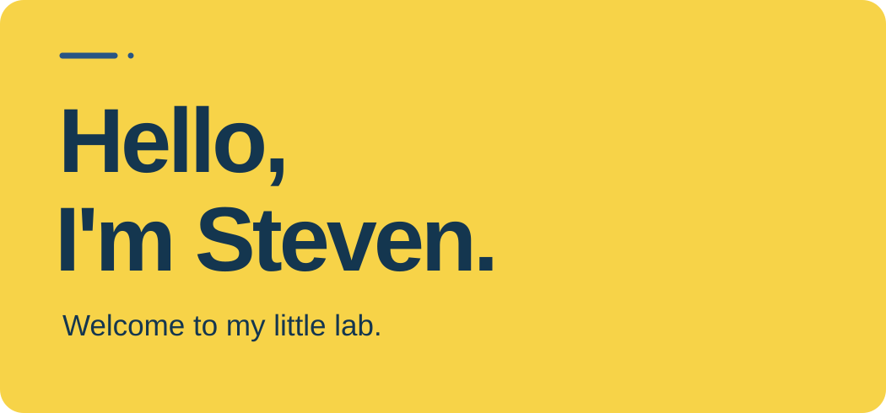

  
  

  <a href="https://stevenlocen.com"><b>Portfolio</b></a>
  &nbsp;·&nbsp;
  <a href="https://stevloc.itch.io/"><b>Itch.io</b></a>
  &nbsp;·&nbsp;
  <a href="https://www.linkedin.com/in/stevloc"><b>LinkedIn</b></a>

<h2>About</h2>

<pre>$ whoami
steven lo

$ education
&gt; information systems management @ cmu
└─ focus: data analytics + business intelligence
&gt; computer science @ nyu
└─ minors: mathematics &amp;&amp; game engineering

$ interests
ai | data science | swe | game design | open source | appdev

$ currently
building practical systems

$ offline
hiking | photography | biking | running
exploring new cities | trying new food
coffee

$ contact
stevloc03@gmail.com

$ website
stevenlocen.com</pre>
